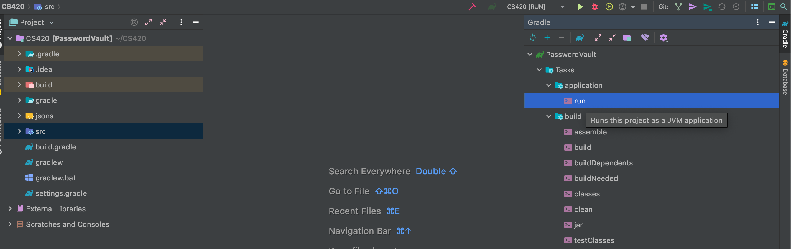

# Basic Wallet Application 
#####     built with JavaFX, using Gradle.
Transactions can be added with amount, date and user note. Transactions can be searched by date and keyword from the notes of the transactions.
## How to run this application
1. Clone the application using the following command `git clone https://github.com/didolaneca/CS420FinalProject.git`
2. Change the directory to the one just cloned using the command `cd CS420FinalProject`
3. In the CS420FinalProject directory run the application with the following command `gradlew run`
#### Alternative way to run the application is through your IDE (**it must support gradle**)
1. Clone the application using the following command `git clone https://github.com/didolaneca/CS420FinalProject.git`
2. Import in your favorite IDE as gradle project
3. From the gradle side menu locate the `run` command 

#### How to Filter transactions by date
* Type a date in a proper format MM/dd/YYYY in the Date input box and 
   click on the `Search transactions by date` button. Transactions  only for the input date
   will be displayed.
    To start a new search all the transactions need to be displayed by pressing the 
   `Show all transactions` button.
   
#### How to Filter transaction by keyword
* Type a keyword into the Note input box and click on 
   the `Search transactions by keyword` button. Transactions only with 
   the "keyword" in their notes will be displayed.
   To start a new search all the transactions need to be displayed by pressing the
   `Show all transactions` button.
  
#### How to add Transaction to the list
* Type a date in a proper format MM/dd/YYYY in the Date input box, 
   type and amount in the amount input box and type a note in the note input box. 
  Click `add a transaction` button 